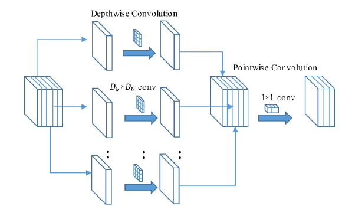
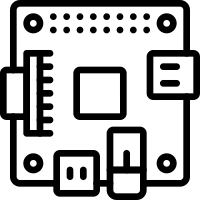

<h2 style="font-size: 3px; display: inline-block;">
  
  IOT TECHNOLOGY BASED TEMPERATURE AND MASK SCAN ENTRY SYSTEM
</h2>

The COVID-19 pandemic resulted in a substantial loss of human life throughout the world, and it poses an unprecedented threat to workplace, public health. Schools, universities, and government offices, public venues shopping malls etc., it is necessary to have a check on body temperature and whether a person is wearing mask or not to avoid Covid-19 spread. We are intended to design a Mask detector model which gives high accuracy when compared to other models and the designed Mask detector model can be efficiently run in the Raspberry Pi. To achieve this, we have trained using various algorithms and comparison is done based on accuracy and precision values and how efficiently the system works. A continuous temperature monitoring is done using the temperature sensor if the person is wearing the mask and having the average body temperature the entry system will be opened. In this project we designed a deep learning model for face mask detection using MobileNetV2 which gave us a accuracy of 99.29% which is better than other algorithms and performs efficiently in Raspberry Pi.

<h3 style="font-size: 3px; display: inline-block;">
  
  TechStack/framework used
</h3>

<h5>Software</h5>
<ul style="list-style-type: circle;">
  <li>Python</li>
  <li>Google Collab</li>
  <li>TensorFlow</li>
  <li>OpenCV</li>
  <li>Raspberry Pi OS</li>
</ul>

<h5>Hardware</h5>
<ul style="list-style-type: circle;">
  <li>Temperature Sensor: MLX90614</li>
  <li>LCD Display(16x2)</li>
  <li>Pi Camera</li>
  <li>L293D Motor Driver</li>
  <li>Raspberry Pi OS</li>
  <li>Resistors (330 ohms and 1k ohms)</li>
  <li>Variable Resistor (10k Ohm)</li>
  <li>Raspberry Pi OS</li>
  <li>Buzzer and LED Lights</li>
</ul>

<h3 style="font-size: 3px; display: inline-block;">
  
  Dataset
</h3>

Datasets are taken from Kaggle, face without masks includes faces with various skin colours, different angles, occlusion, etc which consists of 3584 images which are divided into two subfolders as:
1. With_mask: 1792 Images
2. Without_mask: 1792 Images

<h3 style="font-size: 3px; display: inline-block;">
  
  Methodology
</h3>
Architecture for Face Mask Detection

 
Architecture of Raspberry automation system

 

<h3 style="font-size: 3px; display: inline-block;">
  
  MobileNetV2
</h3>

MobileNetV2 is a convolutional neural network design that aims to be mobile-friendly. It is built on an inverted residual structure, with residual connections between bottleneck levels.
In this part, the core layers of MobileNet, which are depth-wise separable filters, are described first. The construction of the MobileNet network is detailed next, followed by descriptions of the two-model shrinkage hyperparameters, the width multiplier, and the resolution multiplier. Depth-wise separable convolutions, a sort of factorized convolution that separates a standard convolution into a depth-wise and a pointwise convolution, are the cornerstone of the MobileNet model. MobileNets' depth-wise convolution uses a single filter for each input channel. 
 
The outputs of the depth-wise convolution are then mixed by the pointwise convolution utilizing an 11 convolution. A traditional convolution filter combines inputs in one step to create a new set of outputs. It is divided into two layers by the depth-wise separable convolution: one for filtering and the other for joining. This factorization considerably reduces computation time and model size.

<h3 style="font-size: 3px; display: inline-block;">
  
  Raspberry pi
</h3>

Raspberry pi is the single board computers made by the Raspberry Pi Foundation. It was launched in 2012. Low-cost minicomputer with the physical size of a credit card. It runs in Linux and it performs like a normal desktop computer. It also allows interfacing sensors through the general purpose I/O pins (GPIO). Raspberry pi supports Python. In this project we have used Raspberry pi 3 B+ model.

Compared to the Raspberry Pi 2 it has:
<ul style="list-style-type: circle;">
<li>1.2GHz 64-bit quad-core ARMv8 CPU</li>
<li>802.11n Wireless LAN</li>
  <li>Bluetooth 4.1</li>
  <li>Bluetooth Low Energy (BLE)</li>
  <li>1GB RAM</li>
  <li>USB ports</li>
  <li>40 GPIO pins</li>
  <li>Full HDMI port</li>
  <li>Ethernet port</li>
  <li>Combined 3.5mm audio jack and composite video</li>
  <li>Raspberry Pi OS</li>
  <li>Camera interface (CSI)</li>
  <li>Display interface (DSI)</li>
  <li>Micro SD card slot</li>
  <li>Video Core IV 3D graphics core</li>
 </ul>
