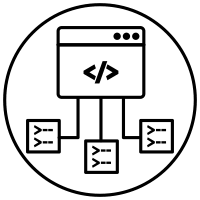
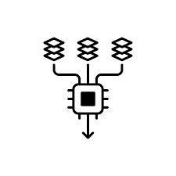
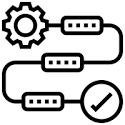
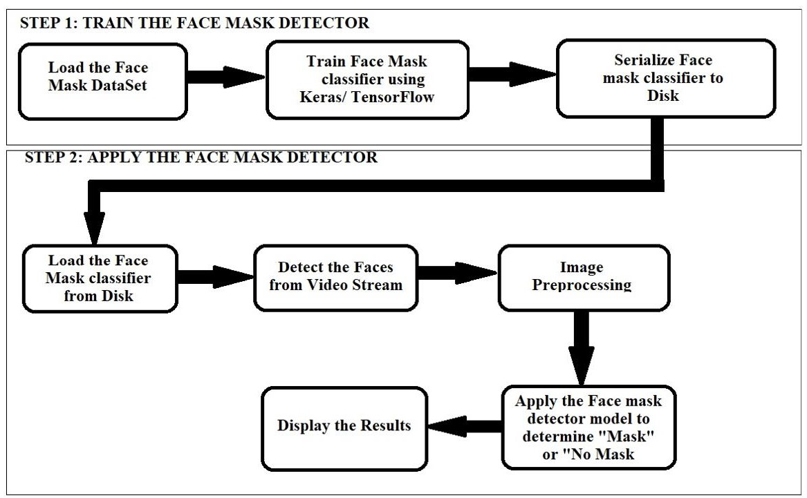
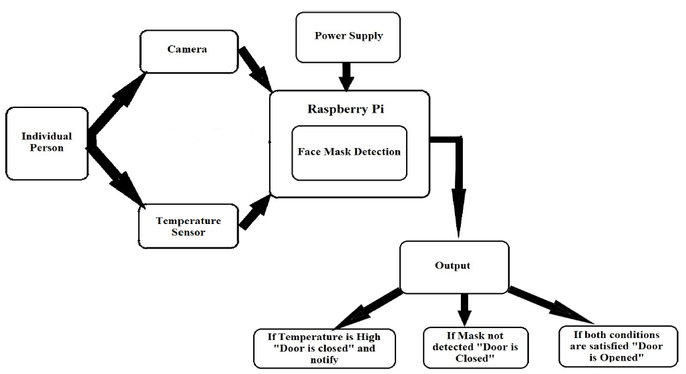

<h2 style="font-size: 3px; display: inline-block;">
  
  IOT TECHNOLOGY BASED TEMPERATURE AND MASK SCAN ENTRY SYSTEM
</h2>

The COVID-19 pandemic resulted in a substantial loss of human life throughout the world, and it poses an unprecedented threat to workplace, public health. Schools, universities, and government offices, public venues shopping malls etc., it is necessary to have a check on body temperature and whether a person is wearing mask or not to avoid Covid-19 spread. We are intended to design a Mask detector model which gives high accuracy when compared to other models and the designed Mask detector model can be efficiently run in the Raspberry Pi. To achieve this, we have trained using various algorithms and comparison is done based on accuracy and precision values and how efficiently the system works. A continuous temperature monitoring is done using the temperature sensor if the person is wearing the mask and having the average body temperature the entry system will be opened. In this project we designed a deep learning model for face mask detection using MobileNetV2 which gave us a accuracy of 99.29% which is better than other algorithms and performs efficiently in Raspberry Pi.

<h3 style="font-size: 3px; display: inline-block;">
  
  TechStack/framework used
</h3>

<h5>Software</h5>
<ul style="list-style-type: circle;">
  <li>Python</li>
  <li>Google Collab</li>
  <li>TensorFlow</li>
  <li>OpenCV</li>
  <li>Raspberry Pi OS</li>
</ul>

<h5>Hardware</h5>
<ul style="list-style-type: circle;">
  <li>Temperature Sensor: MLX90614</li>
  <li>LCD Display(16x2)</li>
  <li>Pi Camera</li>
  <li>L293D Motor Driver</li>
  <li>Raspberry Pi OS</li>
  <li>Resistors (330 ohms and 1k ohms)</li>
  <li>Variable Resistor (10k Ohm)</li>
  <li>Raspberry Pi OS</li>
  <li>Buzzer and LED Lights</li>
</ul>

<h3 style="font-size: 3px; display: inline-block;">
  
  Dataset
</h3>

Datasets are taken from Kaggle, face without masks includes faces with various skin colours, different angles, occlusion, etc which consists of 3584 images which are divided into two subfolders as:
1. With_mask: 1792 Images
2. Without_mask: 1792 Images

<h3 style="font-size: 3px; display: inline-block;">
  
  Methodology
</h3>
Architecture for Face Mask Detection

 
Architecture of Raspberry automation system

